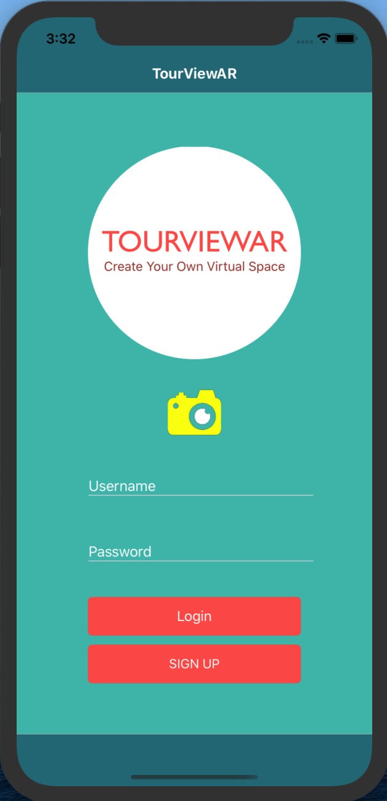
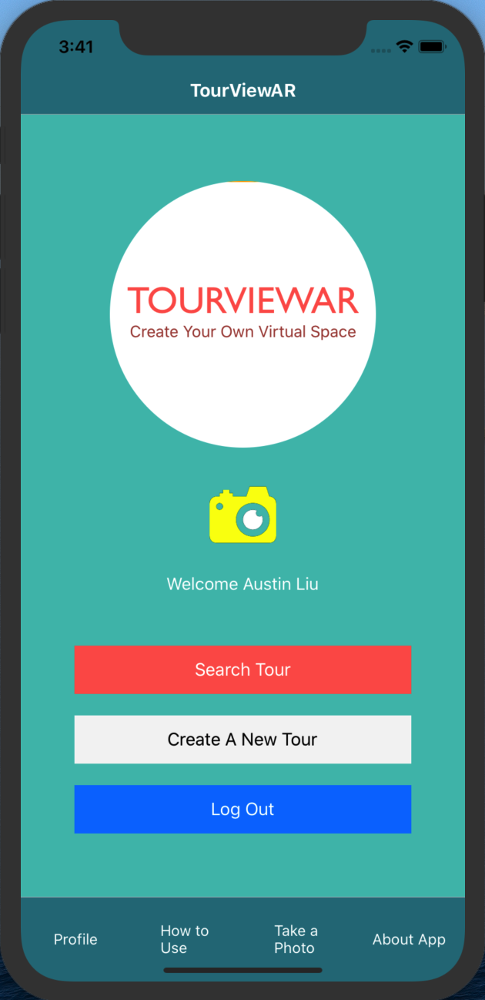
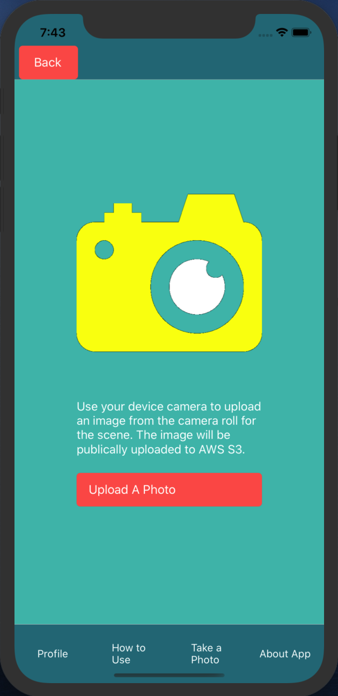

# TourViewAR

TourViewAR is a mobile AR app that allows users to experience tours of 360 degree virtual spaces. This app not only allows users to view AR content, but also create and share it with others. By using their device camera/ photo library to take or upload photos, the photo base is used to construct a 360 degree panoramic scene for a new virtual tour. Inside this scene, users can add AR elements such as text objects, photo objects, or additional 360 degree scenes. These tours can be searched by all users to experience and learn about the virtual tour you have created. Whether you want to share your latest vacation trip, or you're interested in discovering far-off augmented spaces, or you just want to explore hidden gems near your own neighborhood, TourViewAR lets you create, view, and share virtual tours of wherever you can take a photo.  
<br/><br/>
  
<br/><br/>


<br/><br/>

This repository contains the front end source code, built using ViroReact, Redux, and React Native CLI. There is a separate git project deployed to AWS EBS which serves as the [backend server] (https://github.com/liu-austin/TourViewARServer_alpha).

## Installation
Follow the installation guide below to set up and run this source code locally.

### Prerequisites
For IOS:
1. A mac computer and an iOS Device with A9 chip or higher and running iOS 11+ or an [ARCore supported device]
2. XCode to build project
<br/><br/>
For Android:
1. OSX/Linux computer and an ARCore supported device
2. Android Studio to build project
 
### Clone Repo
```sh
git clone https://github.com/liu-austin/TourViewARClient_alpha
cd TourViewARClient_alpha
```

### Install and setup dependencies
For IOS setup:
```sh
npm install
./setup.sh --ios
```
<br/><br/>
For Android setup:
```sh
npm install
./setup.sh android
```
### Running the app
For IOS:
1. Connect IPhone to mac computer if not running on simulator (note: AR scenes will not work in simulators).
2. In XCode, open /ios/tourViewARClient.xcworkspace.
3. Wait for XCode to index project. In Product tab, select Clean Build Folder.
4. Select device to build on in Product/Destination/Choose Destination...
5. In Product tab, select Build For Running.
6. When build has successfully completed, on IPhone go to Settings/General/Profiles & Device Management and trust the developer for TourViewAR
7. Launch TourViewAR app on device.
<br/><br/>
For Android:
1. Go to Settings/ About Phone and tap Build Number row at the bottom seven times. Go to settings/Developer options to enable "USB debugging".
2. Connect Android device to computer if not running on simulator (note: AR scenes will not work in simulators).
3. Check device is connected to ADB by running: adb devices
4. Run:
   ```sh
   react-native run-android
   ```
5.  Launch TourViewAR app on device.

## Download the App
To skip the build process, go to the following link to download the .ipa (IOS app bundle) and .apk (Android app bundle). 
<br/><br/>
[Download Links] (Links)
<br/><br/>
For IOS:
There are several ways to install an .ipa file onto IOS device.
1. In ITunes, select your device and click install app onto device and select the TourViewAR.ipa file. 
2. In XCode, select your device and click install app onto device and select the TourViewAR.ipa file. 
3. Use external apps/ websites to install ipa files onto device.
   
Once it has installed, go to Settings/General/Profiles & Device Management and trust the developers for TourViewAR. Then the app can be launched on your device.
<br/><br/>
For Android:
1. Download .apk file onto Android device.
2. Open Downloads, tap on the .apk file and tap yes. The app will begin installing on your device.

